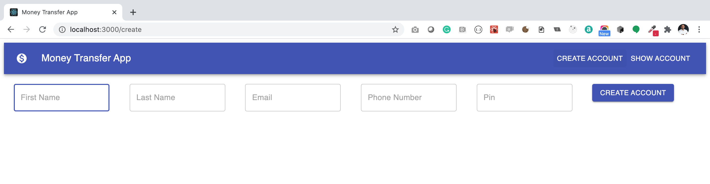
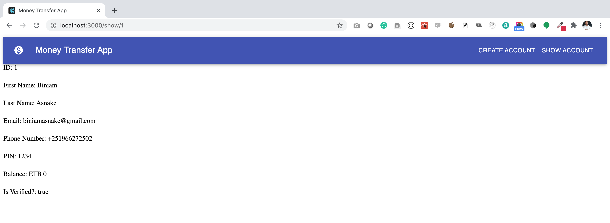

# Notes
# Money Transfer Web App
A ReactJS app that provides a view for Account and money transfer by consuming the Money Transfer API.

### Verisons
ReactJS: 17.0.1  
Node: 14.15.5  
NPM: 6.14.11  

### Contact Developer(s)
Biniam Asnake <biniamasnake@gmail.com>  

### Code Repository
[Github](https://github.com/PracticalSoftwareEngineeringWorkshop/money-transfer-web-app)  
Main/Master branch name: `main`  

### App production URL, CI and Deployment
[Frontend App Production URL](https://money-transfer-web-app-biniam.herokuapp.com/)    
[API Production URL](https://money-transfer-api-biniam.herokuapp.com/api/)  
[Heroku](https://dashboard.heroku.com/apps/money-transfer-web-app-biniam/)  

## Installations
[Create React App](https://reactjs.org/docs/create-a-new-react-app.html)  
```
npx create-react-app my-app
cd my-app
npm start
```

[Axios - for sending API requests](https://www.npmjs.com/package/axios-hooks)  
`npm install axios axios-hooks`  

[Material UI](https://material-ui.com/getting-started/installation/)  
```
npm install @material-ui/core
npm install @material-ui/icons
```

[React Router](https://www.telerik.com/blogs/programmatically-navigate-with-react-router)  
`npm install react-router-dom`  

[Currency Formatter](https://www.npmjs.com/package/react-currency-format)  
`npm install react-currency-format --save`


## Github actions
1. `npm install gh-pages --save-dev`
2. in package.json
```
  "scripts": {
    "predeploy": "npm run build",
    "deploy": "gh-pages -d build",
    "start": "react-scripts start",
    "build": "react-scripts build",
    "test": "react-scripts test",
    "eject": "react-scripts eject"
  },
```
3. IN .git/workflows/main.yml
```
name: CI/CD

# Controls when the action will run.
on:
  # Triggers the workflow on push or pull request events but only for the main branch
  push:
    branches: [ main ]
#  pull_request:
#    branches: [ main ]

# A workflow run is made up of one or more jobs that can run sequentially or in parallel
jobs:
  build_test:
    # The type of runner that the job will run on
    runs-on: ubuntu-latest

    strategy:
      matrix:
        node-version: [16.x]  # [10.x, 12.x, 14.x, 15.x, 16.x]

    # Steps represent a sequence of tasks that will be executed as part of the job
    steps:
      # Checks-out your repository under $GITHUB_WORKSPACE, so your job can access it
      - name: Checkout repository
        uses: actions/checkout@v2
      - name: Use Node.js ${{ matrix.node-version }}
        uses: actions/setup-node@v2
        with:
          node-version: ${{ matrix.node-version }}
      - name: Install dependencies
        run: npm install

#      - name: Run the tests
#        run: npm test --passWithNoTests

      - name: Build
        run: npm run build

      - name: Deploy
        run: |
          git config --global user.name $user_name
          git config --global user.email $user_email
          git remote set-url origin https://${github_token}@github.com/${repository}
          npm run deploy
        env:
          user_name: 'github-actions[bot]'
          user_email: 'github-actions[bot]@users.noreply.github.com'
          github_token: ${{ secrets.ACTIONS_DEPLOY_ACCESS_TOKEN }}
          # Go here to generate a Personal access token https://github.com/settings/tokens
          # Add it in Secrets with ACTIONS_DEPLOY_ACCESS_TOKEN name
          repository: ${{ github.repository }}    # The github.repository variable will automatically get the name of your repository.
```
4. Go to https://github.com/settings/tokens to generate a Personal access token and Add it in Secrets with ACTIONS_DEPLOY_ACCESS_TOKEN name

### Deploy to github pages
Run `npm run deploy`  

## Github Actions
[Setting up a CI/CD workflow on GitHub Actions for a React App (with GitHub Pages and Codecov)](https://dev.to/dyarleniber/setting-up-a-ci-cd-workflow-on-github-actions-for-a-react-app-with-github-pages-and-codecov-4hnp)

### Notes
[Deploying React app to Heroku with zero configuration](https://blog.heroku.com/deploying-react-with-zero-configuration)    
[Adding Custom Environment Variables](https://create-react-app.dev/docs/adding-custom-environment-variables/)  


## Roadmap - the next things to do
1. Implement money transfer view
2. Implement transfer list view
3. Implement Login view
4. Implement snapshot tests

--- 
## Screenshots
List Accounts  


Create Account


Show Account

---

# [The following documentation is auto generated by create-react-app.]

## Getting Started with Create React App

This project was bootstrapped with [Create React App](https://github.com/facebook/create-react-app).

### Available Scripts

In the project directory, you can run:

#### `yarn start`

Runs the app in the development mode.\
Open [http://localhost:3000](http://localhost:3000) to view it in the browser.

The page will reload if you make edits.\
You will also see any lint errors in the console.

#### `yarn test`

Launches the test runner in the interactive watch mode.\
See the section about [running tests](https://facebook.github.io/create-react-app/docs/running-tests) for more information.

#### `yarn build`

Builds the app for production to the `build` folder.\
It correctly bundles React in production mode and optimizes the build for the best performance.

The build is minified and the filenames include the hashes.\
Your app is ready to be deployed!

See the section about [deployment](https://facebook.github.io/create-react-app/docs/deployment) for more information.

#### `yarn eject`

**Note: this is a one-way operation. Once you `eject`, you can’t go back!**

If you aren’t satisfied with the build tool and configuration choices, you can `eject` at any time. This command will remove the single build dependency from your project.

Instead, it will copy all the configuration files and the transitive dependencies (webpack, Babel, ESLint, etc) right into your project so you have full control over them. All of the commands except `eject` will still work, but they will point to the copied scripts so you can tweak them. At this point you’re on your own.

You don’t have to ever use `eject`. The curated feature set is suitable for small and middle deployments, and you shouldn’t feel obligated to use this feature. However we understand that this tool wouldn’t be useful if you couldn’t customize it when you are ready for it.

### Learn More

You can learn more in the [Create React App documentation](https://facebook.github.io/create-react-app/docs/getting-started).

To learn React, check out the [React documentation](https://reactjs.org/).

#### Code Splitting

This section has moved here: [https://facebook.github.io/create-react-app/docs/code-splitting](https://facebook.github.io/create-react-app/docs/code-splitting)

#### Analyzing the Bundle Size

This section has moved here: [https://facebook.github.io/create-react-app/docs/analyzing-the-bundle-size](https://facebook.github.io/create-react-app/docs/analyzing-the-bundle-size)

#### Making a Progressive Web App

This section has moved here: [https://facebook.github.io/create-react-app/docs/making-a-progressive-web-app](https://facebook.github.io/create-react-app/docs/making-a-progressive-web-app)

#### Advanced Configuration

This section has moved here: [https://facebook.github.io/create-react-app/docs/advanced-configuration](https://facebook.github.io/create-react-app/docs/advanced-configuration)

#### Deployment

This section has moved here: [https://facebook.github.io/create-react-app/docs/deployment](https://facebook.github.io/create-react-app/docs/deployment)

#### `yarn build` fails to minify

This section has moved here: [https://facebook.github.io/create-react-app/docs/troubleshooting#npm-run-build-fails-to-minify](https://facebook.github.io/create-react-app/docs/troubleshooting#npm-run-build-fails-to-minify)
